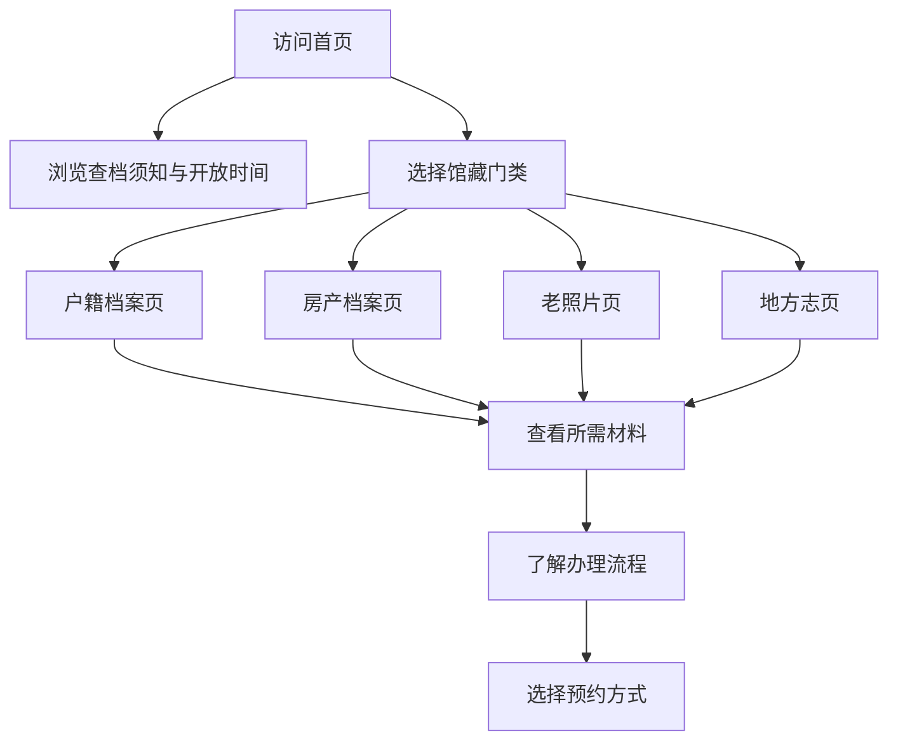

## 1. 产品概述

城市档案馆静态网站，为市民提供档案查询指引服务。页面风格庄重典雅，字号适中偏大，适合中老年访客阅读。

- 主要用途：提供查档须知、开放时间、馆藏介绍、预约方式及各门类档案查询材料要求
- 目标用户：需要查询档案的市民，尤以中老年群体为主
- 产品价值：简化查档流程，提前告知所需材料，减少市民跑趟次数

## 2. 核心功能

### 2.1 功能模块

1. **首页**：馆区介绍、查档须知、开放时间、馆藏门类概览、预约方式入口
2. **户籍档案页**：户籍类档案查询说明、所需材料、办理流程
3. **房产档案页**：房产类档案查询说明、所需材料、办理流程
4. **老照片页**：老照片馆藏介绍、查阅方式、检索指南
5. **地方志页**：地方志馆藏介绍、查阅方式、目录检索

### 2.2 页面详情

| 页面名称 | 模块名称 | 功能描述 |
|---------|---------|---------|
| 首页 | 顶部导航 | Logo、导航菜单（首页、户籍档案、房产档案、老照片、地方志） |
| 首页 | 馆区介绍 Banner | 档案馆名称、标语、背景图 |
| 首页 | 查档须知 | 查档前需要了解的重要事项列表 |
| 首页 | 开放时间 | 工作日/周末开放时间、节假日安排 |
| 首页 | 馆藏门类 | 四大馆藏门类卡片，可点击跳转详情 |
| 首页 | 预约方式 | 电话预约、线上预约、现场预约三种方式 |
| 首页 | 页脚 | 地址、电话、公交信息、版权信息 |
| 户籍档案页 | 页面标题 | 户籍档案查询指南 |
| 户籍档案页 | 档案介绍 | 户籍档案的内容与历史跨度 |
| 户籍档案页 | 所需材料 | 个人查询、委托查询所需材料清单 |
| 户籍档案页 | 办理流程 | 取号-受理-查询-复印-缴费-取件流程图 |
| 户籍档案页 | 常见问题 | 常见问题解答 |
| 房产档案页 | 页面标题 | 房产档案查询指南 |
| 房产档案页 | 档案介绍 | 房产档案的内容与范围 |
| 房产档案页 | 所需材料 | 权利人查询、利害关系人查询所需材料 |
| 房产档案页 | 办理流程 | 办理流程说明 |
| 房产档案页 | 收费标准 | 查询、复印等收费说明 |
| 老照片页 | 页面标题 | 老照片馆藏查阅指南 |
| 老照片页 | 馆藏概览 | 老照片数量、年代跨度、主题分类 |
| 老照片页 | 查阅方式 | 馆藏阅览、网上检索、预约调阅 |
| 老照片页 | 照片精选 | 代表性老照片展示（示意） |
| 地方志页 | 页面标题 | 地方志查阅指南 |
| 地方志页 | 馆藏介绍 | 地方志种类、收藏数量 |
| 地方志页 | 查阅方式 | 室内阅览、目录检索、复印服务 |
| 地方志页 | 志书目录 | 主要志书名录（示例） |

## 3. 核心流程

用户访问首页后，可浏览查档须知和开放时间，也可根据需要查询的档案类型进入对应二级页面，查看具体的材料要求和办理流程，最后选择预约方式前往档案馆。

## 4. 用户界面设计

### 4.1 设计风格

- **主色调**：深枣红色（#8B2323），象征历史厚重与档案庄重
- **辅助色**：米金色（#D4AF37），点缀装饰，提升质感
- **中性色**：米白色背景（#FDF8F0）、深灰色文字（#333333）、浅灰色分隔（#E8E0D0）
- **字体**：标题使用衬线体（思源宋体/Noto Serif SC），正文使用易读的无衬线体（思源黑体/Noto Sans SC）
- **字号**：正文最小 16px，标题层级分明，整体偏大字号便于中老年阅读
- **按钮风格**：圆角矩形，枣红色填充，悬停时加深，有明显点击反馈
- **布局风格**：顶部导航 + 卡片式内容布局，留白充足，行高宽松
- **图标风格**：线性简约图标，与传统风格融合

### 4.2 页面设计概述

| 页面名称 | 模块名称 | UI元素 |
|---------|---------|-------|
| 首页 | 顶部导航 | 固定顶部，深枣红色背景，白色文字，hover 米金色 |
| 首页 | Banner 区 | 大幅背景图（档案馆建筑），半透明遮罩，馆名大标题，副标语 |
| 首页 | 查档须知 | 浅黄色背景提示框，带警告图标，条目清晰列表 |
| 首页 | 开放时间 | 双列布局，工作日/周末分列，时间字号醒目 |
| 首页 | 馆藏门类 | 四卡片网格，每个卡片有图标、标题、简介，hover 上浮动效 |
| 首页 | 预约方式 | 三列布局，电话/线上/现场各配图标与说明 |
| 二级页 | 面包屑导航 | 显示当前位置，可返回首页 |
| 二级页 | 内容区 | 左侧目录导航（可选），右侧正文内容，段落清晰 |
| 二级页 | 材料清单 | 带序号的材料列表，重要材料加粗标红 |

### 4.3 响应式

- 桌面端优先设计，适配平板与手机端
- 移动端导航转为汉堡菜单
- 卡片布局在小屏幕下转为单列堆叠
- 触摸目标尺寸不小于 44px，方便手指点击
- 正文行高 1.8，阅读舒适度高

### 4.4 适老化设计

- 所有可点击元素尺寸充足，间距宽松
- 颜色对比度高，文字清晰可辨
- 避免纯颜色传达信息，辅以图标和文字
- 页面布局简洁，减少干扰元素
- 提供字体大小调整入口（可选增强功能）
