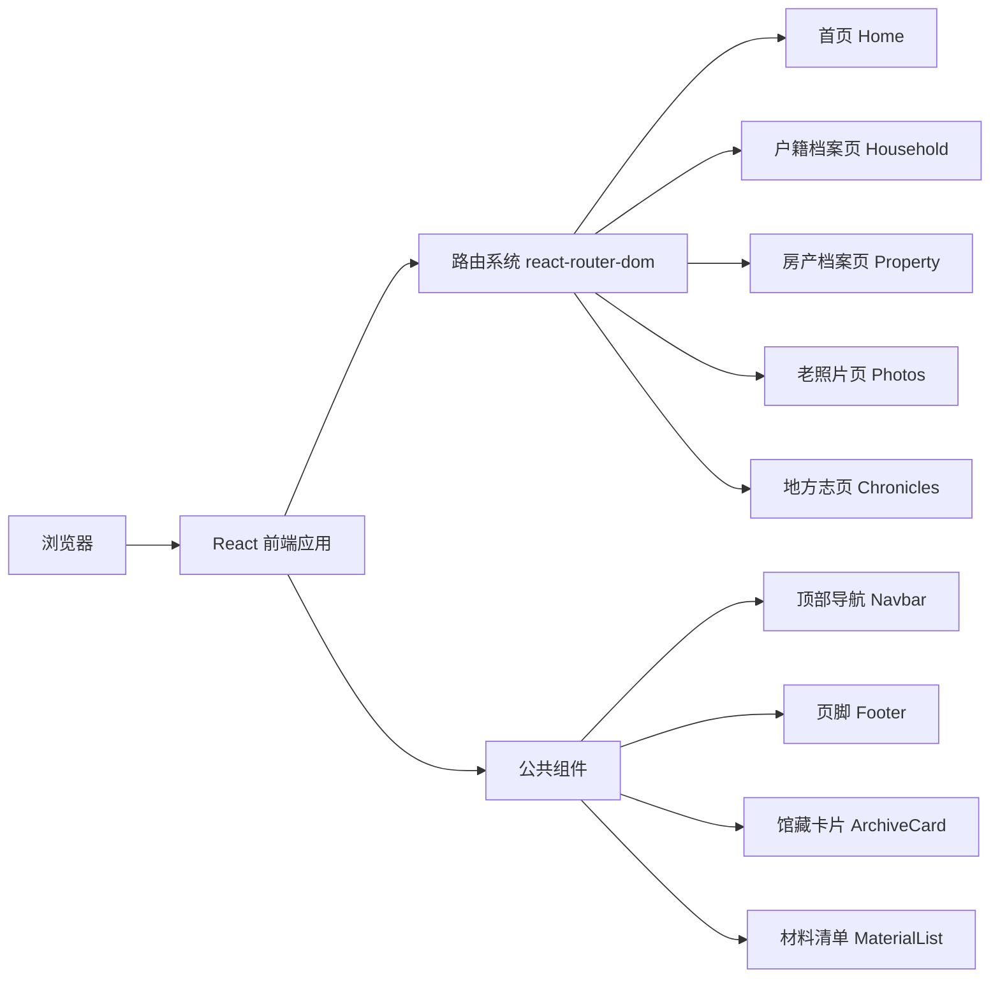

## 1. 架构设计



## 2. 技术描述

- **前端框架**：React@18 + TypeScript
- **构建工具**：Vite@5
- **样式方案**：Tailwind CSS@3
- **路由管理**：react-router-dom@6
- **状态管理**：无需复杂状态管理，使用 React 内置 useState 即可
- **图标库**：lucide-react
- **字体**：Google Fonts - Noto Serif SC（标题）、Noto Sans SC（正文）
- **后端**：无，纯静态网站

## 3. 路由定义

| 路由 | 页面名称 | 说明 |
|------|---------|------|
| / | 首页 | 馆区介绍、查档须知、开放时间、馆藏门类、预约方式 |
| /household | 户籍档案页 | 户籍档案查询指南、材料要求、办理流程 |
| /property | 房产档案页 | 房产档案查询指南、材料要求、办理流程 |
| /photos | 老照片页 | 老照片馆藏介绍、查阅方式 |
| /chronicles | 地方志页 | 地方志馆藏介绍、查阅方式 |

## 4. 项目目录结构

```
src/
├── components/          # 公共组件
│   ├── Navbar.tsx       # 顶部导航
│   ├── Footer.tsx       # 页脚
│   ├── ArchiveCard.tsx  # 馆藏门类卡片
│   ├── SectionTitle.tsx # 区块标题
│   └── MaterialList.tsx # 材料清单组件
├── pages/               # 页面组件
│   ├── Home.tsx         # 首页
│   ├── Household.tsx    # 户籍档案页
│   ├── Property.tsx     # 房产档案页
│   ├── Photos.tsx       # 老照片页
│   └── Chronicles.tsx   # 地方志页
├── data/                # 静态数据
│   └── archiveData.ts   # 档案数据 mock
├── App.tsx              # 应用入口
├── main.tsx             # React 挂载点
├── index.css            # 全局样式
└── vite-env.d.ts        # Vite 类型声明
```

## 5. 数据模型

### 5.1 馆藏门类数据

```typescript
interface ArchiveCategory {
  id: string;
  title: string;
  description: string;
  icon: string;
  route: string;
  color: string;
}
```

### 5.2 材料清单数据

```typescript
interface MaterialItem {
  id: string;
  name: string;
  required: boolean;
  note?: string;
}

interface MaterialSection {
  title: string;
  items: MaterialItem[];
}
```

### 5.3 常见问题数据

```typescript
interface FAQItem {
  question: string;
  answer: string;
}
```

## 6. 技术要点

1. **静态站点**：纯前端实现，无需后端服务，可直接部署到任何静态托管服务
2. **响应式设计**：使用 Tailwind CSS 响应式断点，适配桌面、平板、手机
3. **适老化优化**：大字号、高对比度、充足间距、清晰的视觉层级
4. **性能优化**：静态内容，无复杂动画，首屏加载快
5. **可访问性**：语义化 HTML，合理的 aria 属性，键盘导航支持
6. **SEO 友好**：清晰的页面结构，合适的 meta 标签
